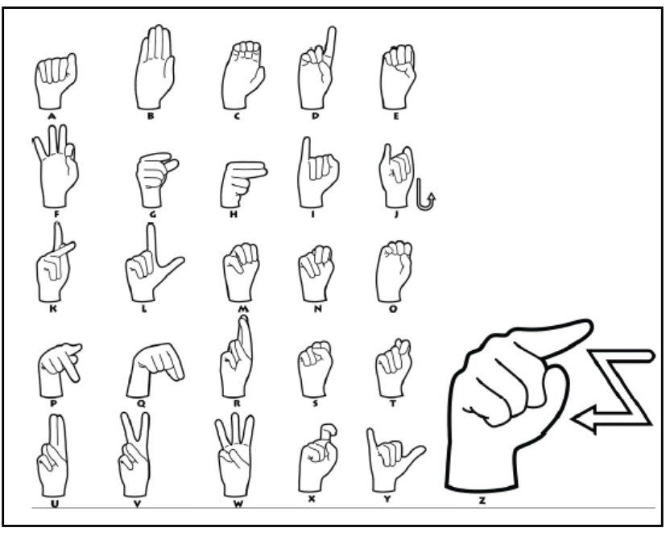
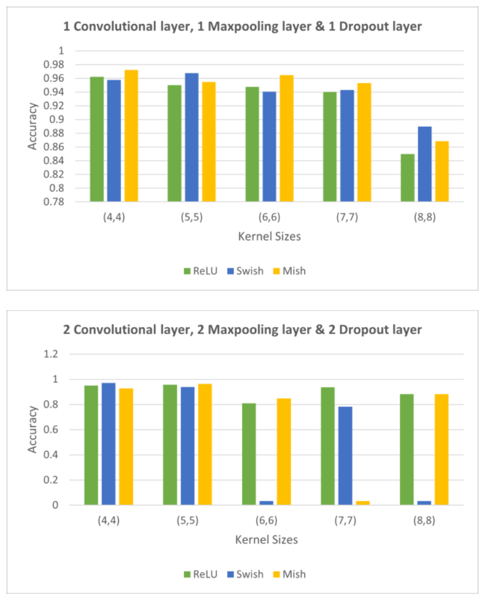
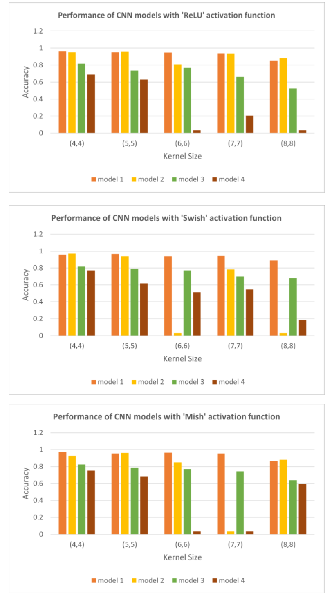

# ASL Image Classification Using CNNs

**CMSC 678 — Machine Learning | University of Maryland, Baltimore County**

## Overview

This project experiments with Convolutional Neural Networks (CNNs) to classify American Sign Language (ASL) alphabet images. A total of **60 CNN models** are trained across 6 notebooks to study how kernel size, depth, activation function, and data augmentation affect classification performance on a 29-class dataset of 87,000 images.



Three research questions are explored:
1. How does varying **kernel size** affect CNN performance (with architecture held fixed)?
2. How do **Swish** and **Mish** activation functions compare to **ReLU**?
3. What is the effect of **data augmentation** on model performance?

## Dataset

[ASL Alphabet dataset](https://www.kaggle.com/grassknoted/asl-alphabet) from Kaggle — 87,000 images at 200×200 pixels across 29 classes:

| Labels | Instances |
|---|---|
| A–Z (26 alphabets) | 78,000 (3,000 each) |
| SPACE | 3,000 |
| DELETE | 3,000 |
| NOTHING | 3,000 |

Images are split 70% train / 10% validation / 20% test using `split-folders`.

## Experiments

Each of the 6 notebooks trains 10 CNN models, varying kernel size and depth:

| Notebook | Activation | Data |
|---|---|---|
| `Part_1_CNN_ReLU_*` | ReLU | No augmentation |
| `Part_1_2_CNN_ReLU_*` | ReLU | Augmented |
| `Part_2_CNN_Swish_*` | Swish | No augmentation |
| `Part_2_2_CNN_Swish_*` | Swish | Augmented |
| `Part_3_CNN_Mish_*` | Mish | No augmentation |
| `Part_3_2_CNN_Mish_*` | Mish | Augmented |

**Models per notebook:** 5 kernel sizes — (4,4), (5,5), (6,6), (7,7), (8,8) — each trained with a 1-conv-layer and a 2-conv-layer architecture = 10 models total.

**Augmentation** (applied in `_2` notebooks): horizontal flip, vertical flip, brightness range [0.2, 1.0].

## Results

### Effect of Kernel Size

Smaller kernels consistently outperformed larger ones. Best accuracy per kernel size on the **non-augmented** dataset:

| Kernel Size | Best Accuracy |
|---|---|
| (4,4) | **97.23%** |
| (5,5) | 96.78% |
| (6,6) | 96.48% |
| (7,7) | 95.33% |
| (8,8) | 88.97% |

On the **augmented** dataset, all models performed significantly worse (best: 82.44% with kernel (4,4)), suggesting the current augmentation strategy does not generalize well for this dataset.

### Effect of Adding a Second Convolutional Layer

Adding a second convolutional layer (+ MaxPooling + Dropout) did not consistently improve performance. For larger kernel sizes (6,6), (7,7), and (8,8), some models failed to converge — likely because the 64×64 input resolution leaves too little spatial information for large kernels across two conv layers.

### Effect of Activation Function

**Mish** outperformed ReLU and Swish in most cases. ReLU and Swish performed comparably across most configurations.





### Best Model

**97.23% test accuracy** — CNN with 2 Convolutional layers, 2 MaxPooling layers, and 2 Dropout layers; kernel size (4,4); Mish activation; trained on non-augmented images.

The model is most confident on: `C`, `D`, `F`, `G`, `I`, `J`, `L`, `O`, `Z`, `del`, `nothing`, `space`. Least confident on: `W`.

## Running the Notebooks

All notebooks are designed for **Google Colab** with data stored on Google Drive.

1. Open any notebook via its "Open in Colab" badge.
2. Mount Google Drive when prompted.
4. Run all cells top-to-bottom — the notebook handles `split-folders` installation and data copying automatically.

## Future Work

- Apply CNN models to **real-time video feed** for continuous ASL translation.
- Combine with an **autocorrect model** for a full translation pipeline.
- Experiment with larger input resolutions (up to 200×200) to give larger kernels more spatial information.
- Evaluate larger kernel sizes — (10,10), (15,15) — and mixed kernel sizes across layers (e.g., (5,5) in layer 1, (3,3) in layer 2).
- Improve robustness to augmented images via more targeted augmentation strategies.

## Repository Structure

```
python_notebooks/                          # Jupyter notebooks for all 60 model experiments
project_proposal_and_final_project_paper/  # Project proposal and final paper (PDF)
```
